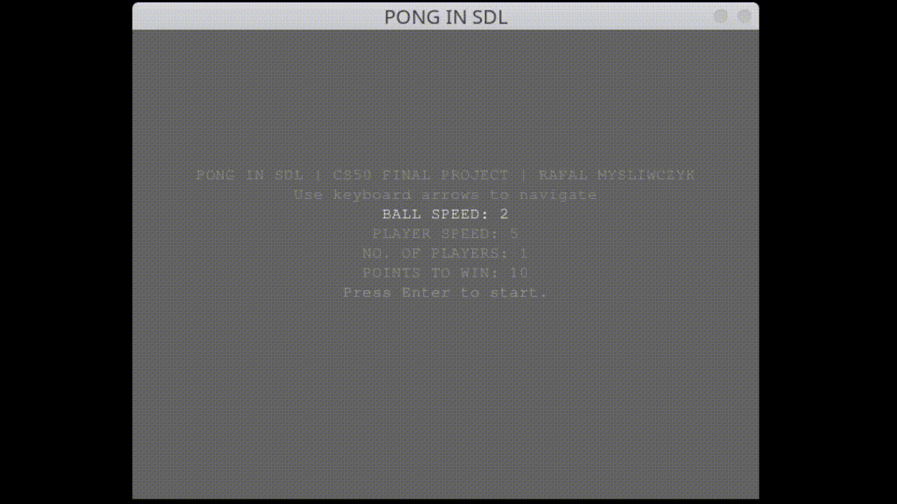

# pong
Pong clone in C and SDL2. This was my final project for [CS50x](https://cs50.harvard.edu/x/2024/)

(the actual game plays faster than this gif)
## Tech stack
* C
* SDL2

## Main features
* Classic pong gameplay
* Customizable options for ball speed and points to win within a text based main menu
* 2 players or player vs CPU

## How to run
### Linux
* Clone the repo or download the source code
* Make sure you've got SDL2. For Debian: `sudo apt install libsdl2-2.0-0`
* make sure `main` file is executable `chmod +x main`
* `./main`

## Controls
* w/s for player one
* up/down for player two
